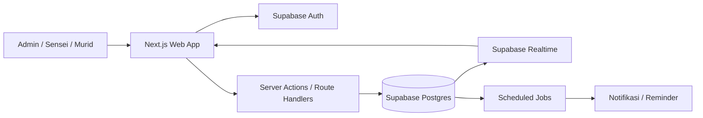
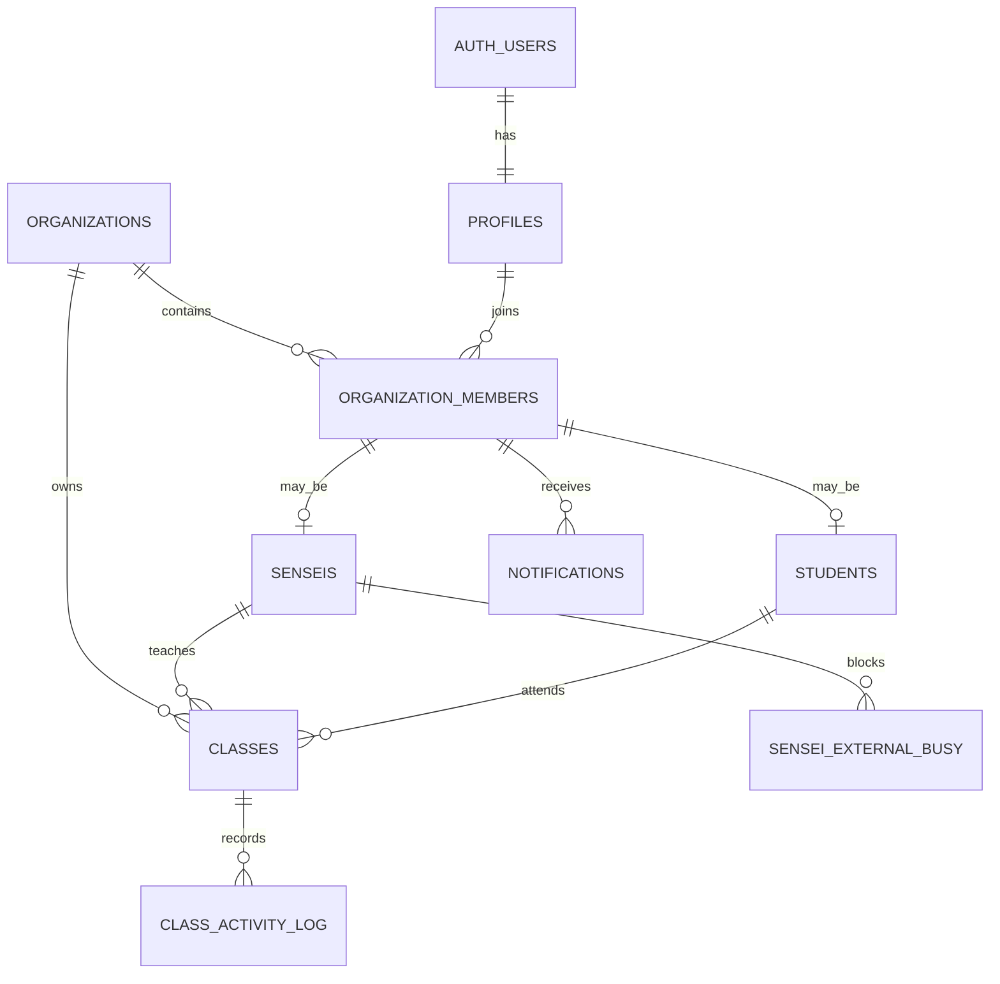
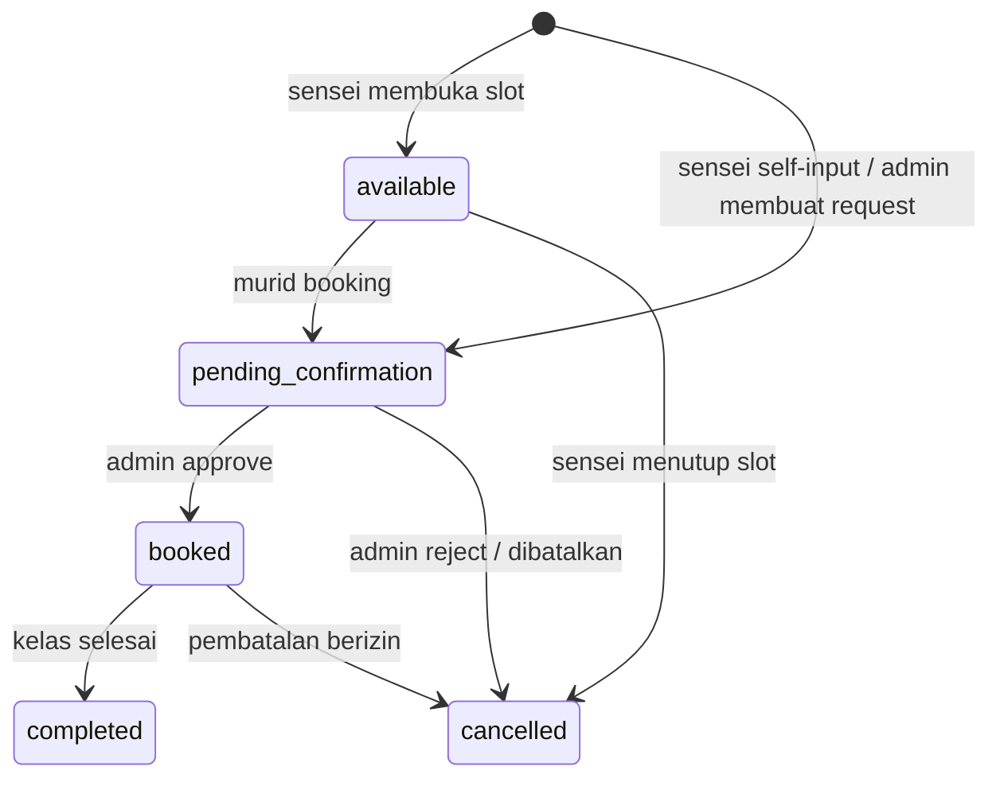

# Arsitektur SaaS Manajemen Kelas Bahasa Jepang

## 1. Tujuan dan keputusan dasar

Sistem adalah SaaS multi-tenant untuk lembaga/kursus bahasa Jepang. Setiap tenant memiliki admin, sensei, murid, jadwal, booking, dan konfigurasi sendiri. Kalender memakai satu sumber event, yaitu tabel `classes`.

Keputusan MVP:

- Booking murid dan input manual sensei berstatus `pending_confirmation` sampai disetujui admin.
- Murid dapat melihat dan memesan sensei mana pun di tenant yang sama; filter sensei utama tetap tersedia.
- Availability dipecah menjadi slot 60 menit, tetapi nilainya menjadi konfigurasi tenant.
- Link meeting diisi manual oleh admin atau sensei.
- Semua waktu disimpan sebagai `timestamptz` dalam UTC dan ditampilkan sesuai zona waktu tenant/user.
- Slot availability disimpan sebagai baris `classes` berstatus `available`.

## 2. Batas sistem



Komponen utama:

- **Next.js**: UI, routing per peran, kalender, form, dan lapisan backend-for-frontend.
- **Supabase Auth**: login dan session.
- **Postgres**: data, transaksi booking, constraint overlap, audit, dan RLS.
- **Supabase Realtime**: sinkronisasi kalender dan notifikasi.
- **Scheduled job/Edge Function**: reminder dan pekerjaan asinkron; bukan bagian jalur transaksi booking.

Browser tidak diberi kewenangan menulis langsung ke `classes`. Semua perubahan status dan jadwal melewati RPC database yang memvalidasi actor, tenant, state transition, dan bentrok dalam satu transaksi.

## 3. Model multi-tenant

Dokumen konsep awal belum memiliki tenant. Untuk produk SaaS, `organization_id` wajib menjadi batas isolasi data.



Tabel inti:

| Tabel | Fungsi dan kolom penting |
|---|---|
| `organizations` | Tenant: `id`, `name`, `slug`, `timezone`, `slot_duration_minutes`, `created_at` |
| `profiles` | Identitas global user: `id = auth.users.id`, nama, email, telepon, avatar |
| `organization_members` | Keanggotaan dan peran per tenant: `organization_id`, `profile_id`, `role`, `status` |
| `senseis` | Ekstensi member sensei: level mengajar, `can_self_book` |
| `students` | Ekstensi member murid: level saat ini, sensei utama opsional |
| `classes` | Satu-satunya sumber event kalender dan lifecycle booking |
| `sensei_external_busy` | Blok waktu di luar sistem; detail hanya terlihat sensei terkait dan admin |
| `class_activity_log` | Audit append-only untuk setiap perubahan kelas |
| `notifications` | Inbox notifikasi per member |
| `booking_requests` (opsional fase lanjut) | Data tambahan request bila satu kelas kelak dapat punya lebih dari satu kandidat |

Kunci dan aturan dasar:

- Semua tabel bisnis memiliki `organization_id` dan foreign key komposit/validasi yang memastikan relasi tidak menyeberang tenant.
- Peran disimpan di `organization_members`, bukan `profiles`, karena satu user dapat menjadi admin di tenant A dan sensei di tenant B.
- Email berasal dari Auth; duplikasi di `profiles` hanya cache tampilan dan harus disinkronkan secara eksplisit.
- `classes` menyimpan `starts_at` dan `ends_at` sebagai `timestamptz`, dengan check `ends_at > starts_at`.
- Gunakan `created_by_member_id`, bukan sekadar user id, agar actor dan tenant tidak ambigu.

## 4. Struktur `classes`

Kolom minimum:

```text
id uuid PK
organization_id uuid NOT NULL
sensei_id uuid NOT NULL
student_id uuid NULL
starts_at timestamptz NOT NULL
ends_at timestamptz NOT NULL
level text NULL
status class_status NOT NULL
source class_source NOT NULL
meeting_url text NULL
notes text NULL
created_by_member_id uuid NOT NULL
version integer NOT NULL DEFAULT 1
created_at timestamptz NOT NULL
updated_at timestamptz NOT NULL
```

Enum:

- `class_status`: `available`, `pending_confirmation`, `booked`, `cancelled`, `completed`.
- `class_source`: `sensei_availability`, `student_booking`, `sensei_self_input`, `admin_manual`.

Invariant database:

- `available` harus memiliki `student_id IS NULL`.
- `pending_confirmation`, `booked`, dan `completed` harus memiliki `student_id IS NOT NULL`.
- Slot yang sudah `cancelled` tidak dapat diaktifkan kembali; buat slot baru agar audit jelas.
- Booking dari slot availability harus **meng-update baris slot yang sama**, bukan insert baris baru.
- `version` dipakai untuk optimistic concurrency pada edit UI.

## 5. State machine



Transisi harus diperiksa di database. UI hanya menampilkan aksi yang sesuai; UI bukan sumber otorisasi.

## 6. Command/RPC terpusat

Satu fungsi dengan banyak parameter dan perilaku campuran mudah menjadi ambigu. Gunakan satu lapisan command database, tetapi pisahkan operasi publik agar kontraknya tegas:

- `open_availability(...)`: membuat banyak slot availability secara atomik.
- `book_available_slot(p_class_id, p_student_id, p_notes, p_idempotency_key)`: mengunci slot dengan `SELECT ... FOR UPDATE`, memastikan masih `available`, lalu mengubahnya ke `pending_confirmation`.
- `create_direct_booking(...)`: khusus admin atau sensei dengan `can_self_book`; membuat `pending_confirmation` tanpa membutuhkan slot availability.
- `decide_booking(p_class_id, p_decision, p_expected_version)`: admin approve/reject.
- `cancel_class(...)` dan `complete_class(...)`: transisi eksplisit dengan otorisasi yang jelas.

Semua fungsi internal memanggil helper yang sama:

- `assert_actor_in_organization`
- `assert_valid_transition`
- `assert_no_schedule_conflict`
- `write_class_activity`
- `enqueue_notifications`

Jika tetap ingin satu nama RPC seperti dokumen awal, tambahkan parameter wajib `p_action`, `p_class_id`, `p_expected_version`, dan `p_idempotency_key`. Tanpa `p_class_id`, sistem tidak dapat membedakan update slot availability dari insert booking baru secara aman.

## 7. Pencegahan bentrok dan race condition

Proteksi dilakukan berlapis:

1. RPC memvalidasi jam, tenant, actor, status, dan external busy.
2. RPC booking mengunci baris availability dengan `FOR UPDATE`.
3. Exclusion constraint GiST menjadi pertahanan terakhir terhadap overlap.
4. Transaksi menangkap `exclusion_violation` dan mengembalikan error domain yang stabil.

Gunakan range `[)` agar kelas 10:00-11:00 tidak bentrok dengan 11:00-12:00:

```sql
tstzrange(starts_at, ends_at, '[)')
```

Constraint aktif untuk `pending_confirmation`, `booked`, dan `completed`; `available` serta `cancelled` dikecualikan. Buat constraint terpisah untuk sensei dan murid. Karena blok eksternal berada di tabel lain, overlap dengannya diperiksa di RPC yang sama dan perubahan `sensei_external_busy` juga harus menolak blok baru bila sudah ada booking aktif.

Catatan penting: constraint saja tidak mencegah dua murid mengambil baris availability yang sama jika implementasi melakukan insert baru. Karena itu booking wajib mengunci dan meng-update slot yang sama.

## 8. RLS dan otorisasi

Prinsip RLS:

- Helper `is_org_member(org_id)`, `has_org_role(org_id, roles[])`, `current_member_id(org_id)`, dan `owns_sensei/student(...)` dibuat sebagai fungsi stabil yang aman.
- Admin dapat membaca dan mengelola seluruh data dalam tenantnya saja.
- Sensei hanya membaca kelas miliknya, blok eksternal miliknya, dan profil murid secukupnya untuk kelas terkait.
- Murid membaca kelas miliknya dan slot `available` dalam tenant yang sama.
- Catatan internal admin tidak dicampur dengan catatan yang boleh dilihat murid.
- `activity_log` append-only; client tidak diberi `UPDATE` atau `DELETE`.
- Tabel `classes` menolak direct `INSERT/UPDATE/DELETE` dari role client. Grant `EXECUTE` hanya pada RPC yang relevan.
- Service role hanya digunakan server/job dan tidak pernah dikirim ke browser.

RLS tetap aktif meskipun akses normal dilakukan melalui server-side Next.js. Ini menjaga isolasi jika endpoint aplikasi salah dikonfigurasi.

## 9. Arsitektur aplikasi Next.js

```text
app/
  (public)/login
  [orgSlug]/
    admin/{dashboard,calendar,bookings,senseis,students,activity}
    sensei/{dashboard,calendar,availability,external-busy,students}
    murid/{dashboard,calendar,history}
features/
  auth/
  calendar/
  availability/
  booking/
  approval/
  notifications/
lib/
  supabase/{browser,server,middleware}.ts
  authorization/
  validation/
```

Aturan aplikasi:

- Middleware hanya memeriksa session dan mengarahkan user; pemeriksaan peran yang menentukan akses dilakukan server-side dan RLS.
- Server Component mengambil snapshot awal. Client Component hanya menangani interaksi FullCalendar dan subscription realtime.
- Query kalender menerima rentang viewport (`from`, `to`); jangan mengambil seluruh histori.
- Realtime event memicu invalidasi/refetch data rentang aktif. Jangan menganggap payload realtime sebagai satu-satunya state yang benar.
- Form memakai schema validation bersama, tetapi database tetap melakukan validasi final.

## 10. Alur utama

### Sensei membuka availability

1. Sensei memilih tanggal/recurrence dan rentang waktu lokal.
2. Server mengonversi ke UTC memakai timezone tenant, termasuk validasi DST.
3. RPC membagi rentang menjadi slot sesuai `slot_duration_minutes`.
4. RPC menolak overlap dengan external busy dan booking aktif.
5. Slot `available` dibuat dan activity log ditulis dalam transaksi.

### Murid booking

1. Murid memilih slot `available` berdasarkan `class_id`.
2. RPC mengunci baris, memvalidasi tenant dan actor, lalu mengecek bentrok murid/sensei.
3. Baris yang sama diubah menjadi `pending_confirmation` dan diisi `student_id`.
4. Activity log dan notification outbox dibuat dalam transaksi yang sama.
5. Admin approve menjadi `booked`; reject menjadi `cancelled`.

### Sensei input booking langsung

1. Fitur hanya tersedia jika `can_self_book = true`.
2. RPC memastikan sensei hanya membuat booking atas identitasnya sendiri.
3. Booking langsung dibuat `pending_confirmation`, tetap melewati validasi overlap.
4. Admin mengambil keputusan melalui RPC approval.

### Sensei membuat external busy

1. Sensei menambahkan blok waktu privat.
2. RPC menolak jika blok menabrak kelas `pending_confirmation`/`booked`/`completed`.
3. Availability yang overlap dapat otomatis dibatalkan dalam transaksi atau operasi ditolak. Untuk MVP dipilih **otomatis membatalkan hanya slot `available`**, tidak menyentuh booking murid.

## 11. Notifikasi dan audit

- Tulis notifikasi in-app dalam transaksi booking.
- Untuk email/WhatsApp, gunakan pola outbox: transaksi menulis `notification_outbox`, worker mengirim, lalu mencatat attempt dan hasil.
- Idempotency key mencegah double-submit akibat retry jaringan.
- Activity log menyimpan `before`, `after`, actor, action, request/correlation id, dan timestamp.
- Data audit tidak boleh berisi token, password, atau detail sensitif yang tidak diperlukan.

## 12. Dashboard dan query

- Buat view/RPC agregasi per tenant untuk total sensei, murid, kelas hari ini, slot available, booking, serta utilisasi.
- Definisi utilisasi MVP: `durasi booked / (durasi booked + durasi available)` dalam periode terpilih. Gunakan durasi, bukan jumlah baris, agar slot berbeda panjang tetap adil.
- Semua agregasi menerima rentang tanggal dan timezone tenant.
- Index utama: `(organization_id, starts_at)`, `(organization_id, sensei_id, starts_at)`, `(organization_id, student_id, starts_at)`, serta partial index status aktif.

## 13. Operasional dan deployment

- Web: Vercel atau platform Node yang mendukung Next.js.
- Database/Auth/Realtime: Supabase dengan migration SQL tersimpan di repository.
- Environment terpisah: local, staging, production; project Supabase berbeda.
- CI: lint, typecheck, unit test, migration lint, dan integration test database.
- Backup: aktifkan point-in-time recovery sesuai paket dan lakukan uji restore berkala.
- Observability: structured logs dengan request id, error tracking, slow-query monitoring, dan audit admin.
- Rate limit untuk login, RPC booking, dan pembuatan availability berulang.

## 14. Tahapan implementasi

1. **Fondasi**: tenant, membership, Auth, schema, enum, indexes, RLS helper.
2. **Mesin jadwal**: constraints, RPC availability/booking/approval, activity log, integration tests race condition.
3. **Aplikasi per peran**: layout, route guard, kalender, form availability, booking, approval.
4. **Realtime dan notifikasi**: invalidasi kalender, bell inbox, outbox reminder.
5. **Dashboard dan hardening**: agregasi, audit UI, rate limit, monitoring, backup/restore test.

## 15. Acceptance criteria MVP

- Tenant A tidak dapat membaca atau mengubah data tenant B, termasuk melalui RPC.
- Dua murid yang booking slot sama secara bersamaan menghasilkan tepat satu pemenang.
- Sensei dan murid tidak dapat memiliki booking aktif yang overlap.
- External busy tidak dapat menabrak booking aktif; availability yang overlap ditutup secara konsisten.
- Semua transisi booking memiliki activity log dan notifikasi yang sesuai.
- Kalender menampilkan status konsisten setelah reconnect/realtime retry.
- Perhitungan tanggal benar untuk timezone tenant dan perubahan DST.
- Direct write ke `classes` dari browser ditolak.

## 16. Pengujian wajib

- Unit test state transition dan pembagian slot.
- Integration test RLS untuk setiap role dan lintas tenant.
- Integration test dua transaksi booking paralel pada slot yang sama.
- Test overlap di batas waktu (`10:00-11:00` berdampingan dengan `11:00-12:00`).
- Test recurrence, timezone, dan DST.
- E2E: sensei membuka slot -> murid booking -> admin approve -> kelas selesai.
- E2E: self-book sensei tanpa izin ditolak; dengan izin masuk approval.
- E2E: external busy membatalkan availability tetapi tidak membatalkan booking aktif.

